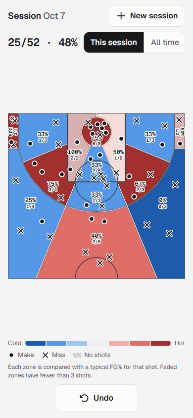
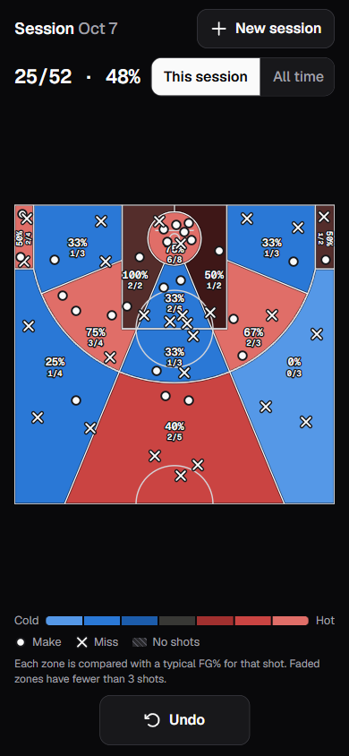

# Shot Tracker

A phone-first basketball shot tracker. Tap where you shot from, log a make or miss, and see your FG% across 14 NBA 2K-style hot zones.

<p>
  
  
</p>

## Features

- **Two taps per shot.** Tap the court, then Make or Miss. Undo removes the last shot.
- **14 hot zones on a FIBA half-court**, with left and right tracked separately: 5 three-point, 5 mid-range and 4 close.
- **Heatmap that judges 2s and 3s fairly.** Colors run from cold (blue) through average (grey) to hot (red), on separate scales for two-pointers (30% to 60%) and threes (20% to 45%).
- **Honest about small samples.** Zones with no shots are hatched, and zones with fewer than 3 shots are faded.
- **This session / All time** views.
- **No account needed.** Everything is saved in your browser (localStorage). Corrupt data is backed up rather than lost.
- Light and dark mode, reduced-motion support, and big touch targets for sweaty thumbs.

## How the zones work

All measurements are FIBA, in metres, with the basket as the origin. Zone edges are angles measured from the basket, mirrored left and right:

| Ring | Zones | Boundaries |
|---|---|---|
| 3PT | left/right corner, left/right wing, top of key | Corners sit below the arc/corner-line break (2.99 m from the baseline). Top of key is within 22.5° of straight-on. |
| Mid-range | left/right baseline, left/right elbow, straightaway | Straightaway is within 22.5°, elbows run from 22.5° to 67.5°, baselines are beyond 67.5°. |
| Close (paint) | restricted area, left/right short, short center | The restricted area is the 1.25 m no-charge circle. Short center is within 22.5°, up to the free-throw line. |

A shot exactly on the 3-point line counts as a two. The full design is in [`docs/superpowers/specs/2026-10-07-shot-tracker-design.md`](docs/superpowers/specs/2026-10-07-shot-tracker-design.md).

## Run it locally

Requires Node.js 20.19+ or 22.12+.

```bash
npm install
npm run dev      # start the dev server
npm test         # run the test suite (Vitest)
npm run build    # production build in dist/
```

To try it on your phone, run `npm run dev -- --host` and open the "Network" URL on a phone connected to the same Wi-Fi.

## Tech stack

Vanilla JavaScript (no framework), [Vite](https://vite.dev), [Vitest](https://vitest.dev) with jsdom, and inline SVG for the court. Fonts are [Geist](https://vercel.com/font) and icons are [Phosphor](https://phosphoricons.com).

## Project structure

```
src/
  court/geometry.js   FIBA dimensions and classifyZone(x, y): which of the 14 zones a point is in
  court/render.js     SVG court: zone shapes, dividers, labels, shot markers
  stats.js            FG% per zone and session totals
  heatmap.js          maps a zone's FG% to a cold/hot color tone
  state.js            sessions and shots (pure functions)
  store.js            localStorage load/save, corrupt-data recovery
  app.js              app state, saving, and change notifications
  ui/shotPicker.js    the Make/Miss popover
  ui/controls.js      header, totals, view toggle, Undo, banners
  main.js             wires everything together
tests/                unit tests for each module
```

## Known issues

- [ ] Close zones use the two-point color scale, so a typical ~60% finisher at the rim shows as hot
- [ ] The Make/Miss popover has no Escape to cancel, and the court isn't usable with a keyboard
- [ ] Two open tabs overwrite each other's saves
- [ ] Vertical corner labels can sit under shot markers
- [ ] No favicon yet
